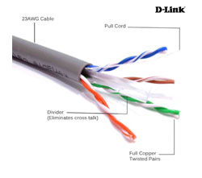
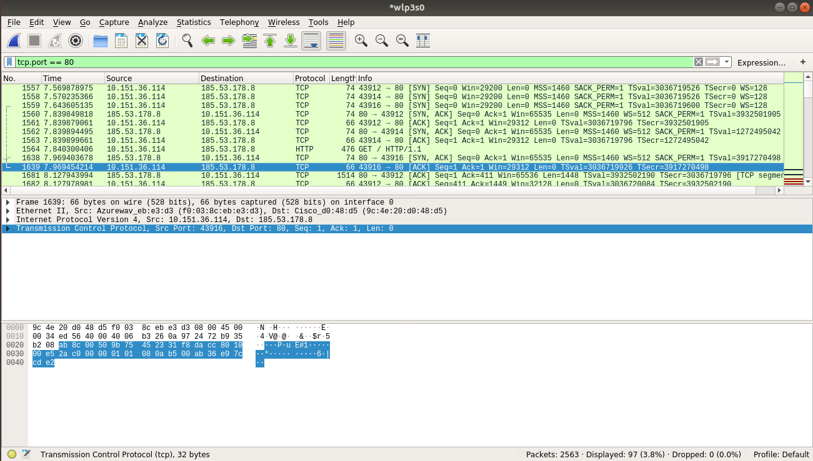
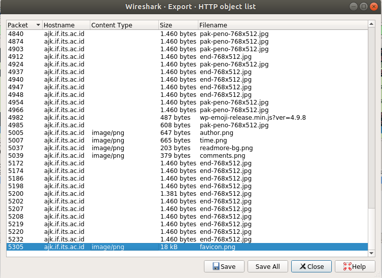

# Crimping and Wireshark

## Table of Content

+ 1.[Wire Crimping](#1-wire-crimping)
     + 1.1 [Tools needed](#11-tools-needed)
     + 1.2 [UTP Cable Configuration](#12-cable-configuration)
     + 1.3 [Crimping Steps](#13-crimping-steps)
+ 2.[Wireshark](#2-wireshark)
	+ 2.1 [Installation](#21-installation)
	+ 2.2 [Filters](#22-filters)
	+ 2.3 [Export Packet Capture Data](#23-export-packet-capture-data)
	+ 2.4 [Wireshark Usage on FTP Server](#24-wireshark-usage-on-ftp-server)

## 1. Wire Crimping
In a computer network, communication occurs between one device to the other. For this to happen, of course there needs a medium. Although there is already wireless communication technology, wires still have a major role in network and can't be replaced. Therefore, in this module, we will learn how to crimp a type of network cable called UTP (Unshielded Twisted Pair).

### 1.1 Tools needed

To do wire crimping, the following tools are needed.

#### a. UTP Cable



The base needed in this process.

#### b. RJ45


RJ45 is a the connector used to connect UTP cable to the devices.

#### c. Crimping Pliers


Crimping pliers or Crimpers are used to attach wires to RJ45.

#### d. LAN Tester


As the name suggests, this tool is used to check whether the cable we make is working properly or not.

### 1.2 Cable Configuration

  There are several types of cable configurations. Based on the color order, according to international standards, there are divided into __T568A__ and __T568B__.


While from the cable installation, there are divided into :

#### a. __Straight-Through Cable__

  This type of cabling is used to connect two different types of devices connected to the network, namely DTE (data terminal equipment) devices to DCE (data circuit-terminating equipment) or vice versa. DTE devices are devices that generate digital data and act as source and destination for digital data, e.g. computers, microcomputers, terminals, printers. DCE is a device that receives and converts data to the appropriate telecommunications link, generally DCE is a network device such as routers, switches, modems.
  

  
  The installation rule is that each end of the cable must have the same color sequence. For example, if the one end uses a color arrangement based on the T568A rule, so does the other one.

#### b. __Crossover Cable__

  In contrast to the Straight-through cable, crossover cable is used to connect the same two types of devices connected to the network, i.e. DTE to DTE or DCE to DCE devices. For example, between computers and computers, routers and routers, routers and switches, computers and printers.

  
  
  The installation rules are also different from straight-through cables, crossover cables have different color sequences at both ends. However, this color difference should not be arbitrary, because these two ends also have a color order rule. In standard crossover cables, if one end of the Pin has a color arrangement according to the T568A rule, then the other end of the Pin must have a color order according to the T568B standard.

### 1.3 Crimping Steps

  1. Prepare the crimping needs (UTP cable, RJ45, crimping pliers, LAN tester)
  2. Strip the UTP cable shield
  3. Sort the cables according to the configuration needed (Straight/Cross/others).
  4. Cut the ends of the wires to flatten them out.
  5. Insert the end of the cable into the RJ45 and make sure it touches the end of the RJ45.
  6. Use crimpers to lock the UTP cable in the RJ45 (make sure the cable end is still attached to the RJ45 end when locking is done)
  7. Finally, use a LAN tester to make sure the cable is working properly.

## 2. Wireshark
Wireshark is a network packet analyzer application. The network packet analyzer will try to capture network packets and display the packet data as detailed as possible. A computer network is built with the aim of sending or receiving data between one end-point and another. Data is sent in the form of packets. The structure of a package consists of:

***1. Header***
The header section contains the address and other data carried by the packet. The structure of the header includes:

| Instructions | Description |  
|--  |---|
| Packet length | Some networks already have a fixed-length packet , while others rely on headers to contain this information |  
| Synchronization | Bits that help packets match the intended network |  
| Packet number | Shows the order of the total packets available |
| Protocol | On networks that carry more than one kind of information, this protocol indicates the type of packet being transmitted, e.g., e-mail, web page, or other. |  
| Destination address | Where is the packet sent |  
| Source Address | Where did the packet come from |  

***2. Payload***
Payload is also referred to the **body** of the packet. This is where the data that will be sent via the packet is located.

***3. Trailer***
A trailer, or sometimes called a ***footer***, contains a pair of bits that signal to the reciever that the packet has reached its end. It can also provide some sort of *error checking*.

### 2.1 Installation

For installation on Windows OS or macOS, you can download the installer on [this page](https://www.wireshark.org/download.html). For Linux OS, see the tutorial [here](https://linuxtechlab.com/install-wireshark-linux-centosubuntu/).
After the installation completed, run Wireshark as an **administrator** (Windows) or as a **root** (Linux).
Here's the initial view :


### 2.2 Filters
In Wireshark, there are 2 types of filters, i.e. ***Capture Filter*** and ***Display Filter***

#### 2.2.1 Capture Filter


 - Definition : Filtering packets to be captured. Packets that don't meet the criteria are allowed to pass without being captured.
 - The filter syntax can consist of 1 or more **primitives**.  Primitive itself usually consists of an **id** (number or name) which is preceded by 1 or more types of qualifiers. Keep in mind that a primitive cannot have 2 or more of similar qualifiers.
 - Type of qualifier :

| Qualifier | Description | Example |
|--|--|--|
| type | Specifies the type of id or name to be the filter value | host, net, port, portrange |
| dir | Specifies a particular transfer direction to and/or from id | src, dst, etc|
| proto | Specifies the protocol from id | tcp, udp, etc |

 - The filter syntax can contain operators, parentheses, negations ( `!` / `not` ), and conjunctions ( `&&` / `and` or `||` / `or` ). Conjunctions are used to connect 2 primitives in one syntax
 - Example capture filter syntax :

| Filter expression / Primitive(s) | Description |
|--|--|
| `host 10.151.36.1` | Captures all specific packets from/to address 10.151.36.1 |
| `src host 10.151.36.1` | Captures all specific packets from address 10.151.36.1 |
| `net 192.168.0.0/24` or `net 192.168.0.0 mask 255.255.255.0` | Captures all packets from/to subnet 192.168.0.0/24 |
| `dst net 192.168.0.0/24` | Captures all packets going to subnet 192.168.0.0/24 |
| `udp port 80` | Captures all packets with UDP protocol from/to port 80 |
| `tcp src port 22 or host 10.151.36.30` | Captures all packets with TCP protocol from port 22 or packets from/to address 10.151.36.30 |

 - Example of capture filter `host 10.151.36.1`


#### 2.2.2 Display Filter


 - Definition : Filtering packets to be displayed from a collection of packets that have been captured.

 - In general, the display filter syntax consists of  `[protocol] [field] [comparison operator] [value]`. A complete list of available **comparison operators** is shown in :

| English | Comparison Operator (C-like) | Description |
|---|---|---|
| eq | == | Equal |
| ne | != | Not equal |
| gt | > | Greater than |
| lt | < | Less than |
| ge | >= | Greater than or equal to |
| le | <= | Less than or equal to |
| contains |  | Protocol, field or slice contains a value |
| matches | ~ | Protocol or text field matches a **regular expression** |
| bitwise_and | & | Bitwise AND operator|

 - The display filter can be combined with ***logical operator***.

| Logical Operator | Description |
|---|---|
| `and` or `&&` | logical AND |
| `or` | logical OR |
| `xor` or `^^` | logical XOR |
| `not` or `!` | logical NOT |
| `[...]` | substring operator |
| `in` | membership operator |

 - Some example on Display Filter :

| Filter expression | Keterangan |
|---|---|
| `tcp.port == 443` | Displays all packets with TCP protocol from/to port 443 |
| `ip.src == 192.168.0.1 or ip.dst == 192.168.0.1` | Displays all packets from address 192.168.0.1 or packets to address 192.168.0.1 |
| `http.request.uri constains "login"` | Display all packets with HTTP protocol whose URI contains "login" string.

 - As an example of display filter `tcp.port == 80`, the result is as follows :


### 2.3 Export Packet Capture Data

 1. After having the packet, select File on the menu bar -> Export Objects -> (select the desired protocol), in this case, the HTTP protocol is selected.

 2. Select the packet to be exported. In this case, the packet that load images from a particular site is selected. Then click Save and provide the file name, path, and extension if needed.

 3. File exported successfully.


### 2.4 Wireshark Usage on FTP Server

Run the wireshark application before connect to the FTP server.

#### 2.4.1 Connect ke Server

##### a. Windows

For windows, we will use FileZilla. For an experiment on the server, we used Filezilla Server and Filezilla Client on the client side. Here, we can set both server and client on the same device or use different devices (as long as they are connected to a computer network).

###### FTP Server Creation on Filezilla Server

1. Open Filezilla Server (can be accessed through the Filezilla Server desktop application or XAMPP by starting the Filezilla module and click the Admin button). If a pop up "Connect to Server" appears, just click Ok and the following display will appear.


2. Click Edit menu -> Users. In the Users column on the most right position, add a new user by clicking Add and entering the FTP username. Here are the results after adding the user (in this case, added the user "coba"). If you want to use a password, check the "Password" box and enter your password.


3. After the user is created. Then enter the shared folder settings to configure the folder to be shared or remotely via FTP. On the Users column, select user, and on the Shared folders column, click the "Add" button to add a directory. Next, we can set the permission for the user selected on the shared folder by checking the boxes in the Files and Directories sections.


FTP Server was created successfully.

#### 2.4.2 Client Connection

##### a. Using Filezilla client

Open FileZilla and enter *Host* , *Username* , *Password* , and *Port* of the server that we will connect to. Then, click Quickconnect to make a connection.


##### b. Using Linux command

`$ ftp [Host ip]`
Enter username and password, then run like using CLI.

When the capture results are available, the data will appear as shown below:


| Command | Descripton |
|---|---|
| USER | Username used to login to the FTP server |
| PWD | Password used to login to the FTP server |)

#### 2.4.3 Upload Files

##### a. Using Filezilla client
While using FileZilla client, drag files from Local site and drop on Remote site.

| Command | Description |
|---|---|
| STOR | Uploading files to FTP server |

##### b. Using Linux command
Upload command on Linux
```
$ put [full path file]
```

When the capture results are available, the data will appear as shown below:


#### 2.4.4 Download Files

##### a. Using Filezilla client
While using FileZilla client, drag files from Remote site and drop on Local site.

| Command | Decription |
|---|---|
| RETR | Downloading a file from an FTP server |

##### b. Using Linux command
Download command on Linux
```
$ get [filename]
```

When the capture results are available, the data will appear as shown below:


## Excercise

1. When accessing a web page, what port does a packet go to?
2. What is the difference between accessing the main page of its.ac.id and monta.if.its.ac.id? Explain your answer!
3. How many packets are sent by the web server when downloading a file? Why did it happen?
4. From the packet analysis result, what is the difference between a persistent connection and a non-persistent connection?
5. What is the difference between basic authentication method and digest?
6. What is the difference between accessing a normal web page and accessing a web page when the login process occurs?
7. What information does the browser always send to the web server? Export the packet capture data.
8. Are there packets sent by your device when you are not accessing the browser? If so, try to find the domain!
9. Access the website http://www.columbia.edu/~fdc/sample.html, download the image on the page and try to download that picture again from wireshark!

## Reference
+ https://nyengnyeng.com/macam-macam-kabel-jaringan-komputer/
+ http://haidirhmc.blogspot.com/2011/12/urutan-warna-kabel-lan-atau-kabel-t568a.html
+ https://www.nesabamedia.com/pengertian-dan-fungsi-kabel-utp/
+ https://www.berguruit.com/2017/09/cara-crimping-kabel-lan-rj45-yang-baik.html
+ https://www.wireshark.org/docs/wsug_html_chunked/ChapterIntroduction.html
+ https://www.wireshark.org/docs/wsug_html_chunked/ChCapCaptureFilterSection.html
+ https://www.wireshark.org/docs/wsug_html_chunked/ChWorkBuildDisplayFilterSection.html
+ https://computer.howstuffworks.com/question5251.htm]
+ https://www.comparitech.com/net-admin/difference-between-straight-through-crossover-rollover-cables/
+ https://www.indowebsite.co.id/kb/cara-mengaktifkan-ftp-pada-localhost-atau-xammp/
