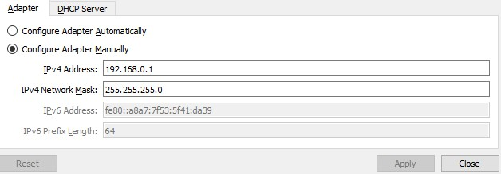
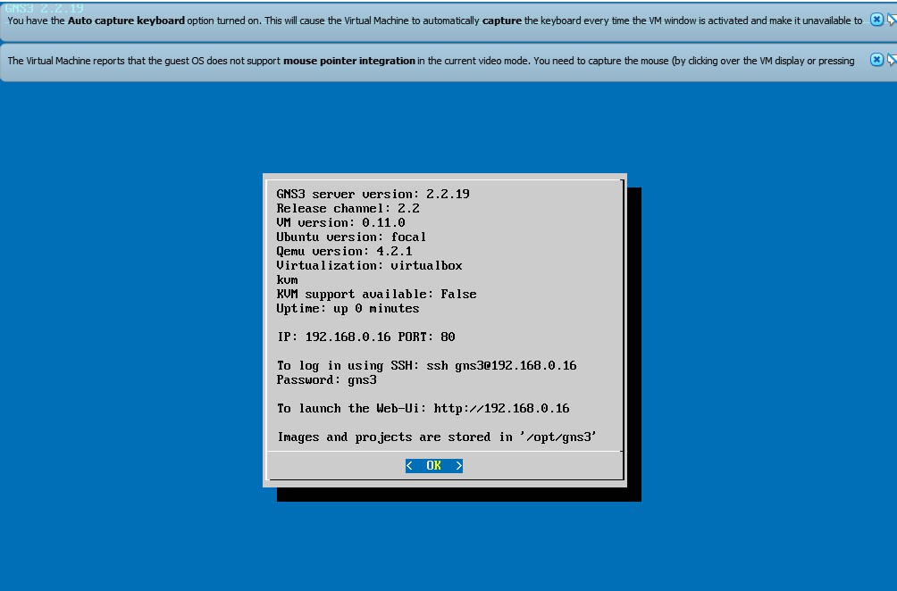
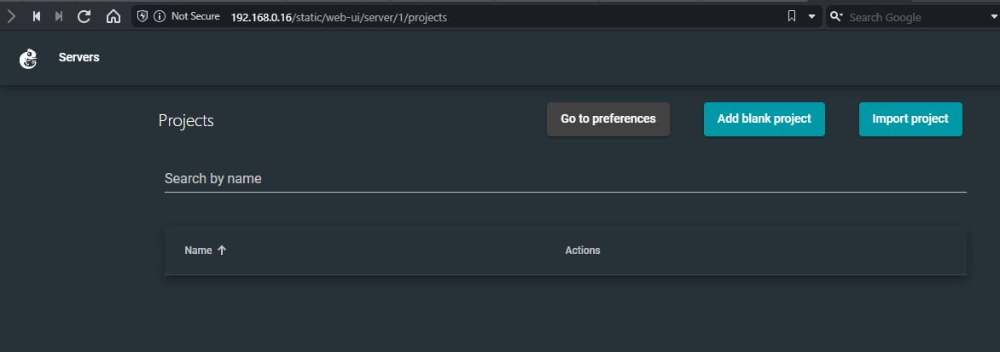
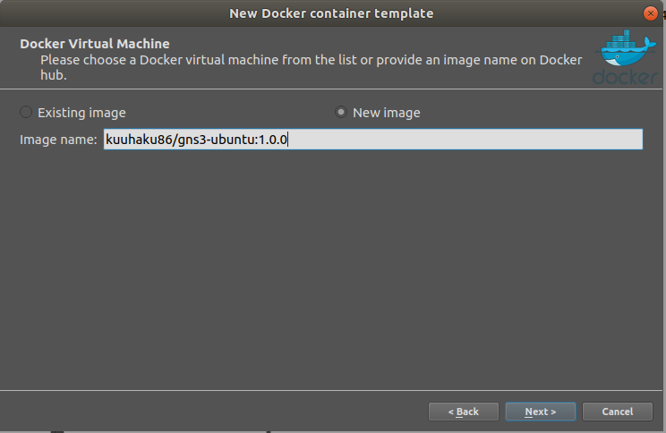
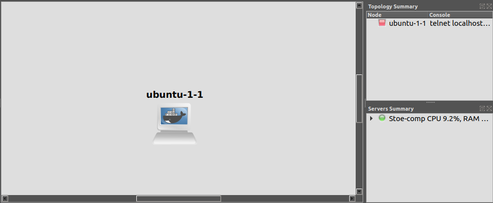
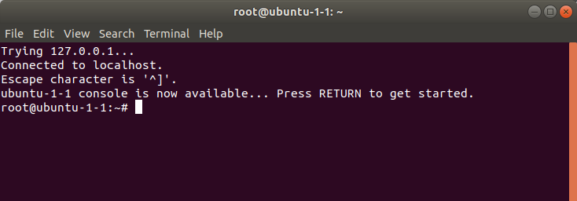
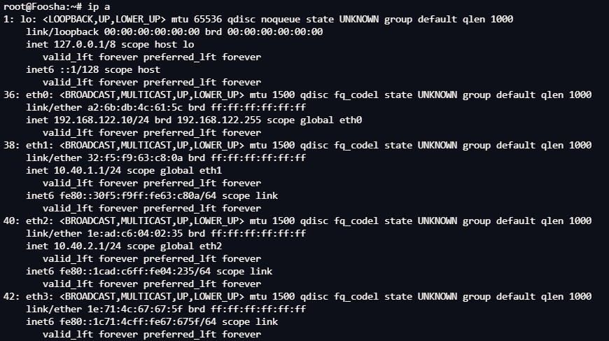

GNS3 Introductory Module
===============

- [GNS3 Introductory Module](#gns3-introductory-module)
  - [what is GNS3?](#what-is-gns3)
  - [GNS3 Installation](#gns3-installation)
    - [Using VM](#using-vm)
    - [Using Ubuntu](#using-ubuntu)
  - [GNS3 Usage](#gns3-usage)
    - [Setup IP](#setup-ip)
      - [Prefix IP Distribution](#prefix-ip-distribution)
      - [Setup IP in Node](#setup-ip-in-node)
    - [Internet access of a Node](#internet-access-of-a-node)
    - [Making Topology](#making-topology)
  - [Terms](#terms)
  - [Warnings, Advice, Tips and Tricks](#warnings-advice-tips-and-tricks)
  - [Troubleshooting](#troubleshooting)
  - [References](#references)

## what is GNS3?
**GNS3 (Graphical Network Simulator-3)** is a tool that helps you to be able to run a simulation from a small topology consisting of only a few tools on your computer to a topology that has many tools hosted on several servers.

## GNS3 Installation
### VM Using
1. Installing VirtualBox
Please download from [following link](https://www.oracle.com/virtualization/technologies/vm/downloads/virtualbox-downloads.html) or [the following link (Drive ITS).](https://drive.google.com/file/d/10R5GyMtn0R8yWLDvhmxKMl_GySD2gXUK/view?usp=sharing)

2. Download Image VM GNS3
Please download from [following link](https://github.com/GNS3/gns3-gui/releases/download/v2.2.19/GNS3.VM.VirtualBox.2.2.19.zip). After that, extract it.

3. Import .ova file to VirtualBox


4.  Creating a new host network adapter
  - Select File Menu -> Host Network Manager <br/>

  - Click Create <br/>

  - Then set the IPv4 Address to `192.168.0.1`, and the IPv4 Network Mask to `255.255.255.0` then click apply


5. Change Network Adapter in VM 
  - Go to Settings -> Network
  - Change Adapter 1 to Host-only Adapter and match it with the previously created network host

  - And change Adapter 2 to NAT <br/>

  - Then click OK

6.  Run the VM
  - Then the VM should be able to display this

  - Then open the address with the caption "To launch the Web-UI" in the browser


7. Import ubuntu image
  - Click `Go to preferences`
  - Click `Docker`
  - Click `Add Docker container template`
  - `Server type` choose `Run this Docker container locally`
  - Click `Docker Virtual Machine`, choose `New image` fill `kuuhaku86/gns3-ubuntu:1.0.0` in Image name

  - Click `Container name` fill `ubuntu-1` as container name
  - Click `Network adapters` and enter the number 4 
  - Then click `Add template` button on the bottom.

8. Try the imported image
  - Click `Servers` on upper left
  - Click `local`
  - Click `Add blank project`
  - Enter the project name (any name)
  - Click `Add project`
  - Click `Add a node` button on the left <br/>

  - Then drag `ubuntu-1` to an empty area on the page
  - Wait until loading is complete
  - If successful will display a display similar to this

  - We can start by right-clicking on node and click `Start` <br/>


9. Access the node
  - Can be done with `Web console` <br/>

  - This can be done using the command `telnet [VM IP] [Port node]` according to the one on the right, if you use the example in the picture, the command is `telnet 192.168.0.16 5000`

  - If using telnet, be careful if you want to exit the node. Use `Ctrl + ]` then type quit to exit the node.
  - If the command prompt doesn't come out, you can click enter many times until it comes out

### Using Ubuntu
1. Install GNS3
Please follow the steps from the following link [Ubuntu-based distributions (64-bit only).](https://docs.gns3.com/docs/getting-started/installation/linux/)

2. Import ubuntu image
  - Click `Edit > preferences`
  - Click `Docker container` (usually on the bottom most)
  - Click `New`
  - In `Docker Virtual Machine`, choose `New image` fill `kuuhaku86/gns3-ubuntu:1.0.0` in Image name, then click next.

  - In `Container name` enter `ubuntu-1` as the container name, then click next.
  - In `Network adapters` and enter the number `4`, then click next.
  - In the `Start command` leave blank, then click next.
  - In `Console type` select `telnet`, then click next.
  - In `Environment` leave blank, then click `finish`.
  - Then click `Apply` and `OK` button.

3. Try the imported image
  - Click `End devices` on the left side (monitor shape icon)
  <br/>

  - Then drag `ubuntu-1` to an empty area on the page
  - Wait until loading is complete
  - If successful will display a display similar to this

  - We can start by right-clicking on the node and clicking `Start`.

4. Access the node
  - This can be done by right-clicking on the node and clicking `console`. <br/>

  - Can be done using the command `telnet [IP VM] [Port node]` according to the right, if using the example in the picture, then the command is `telnet 127.0.0.1 5000` (hover the cursor to the node to see the port node)

  - If using telnet, be careful if you want to exit the node. Use `Ctrl + ]` then type quit to exit the node.
  - If the command prompt doesn't come out, you can click enter many times until it comes out

## GNS3 Usage

### Setup IP
In computer network practicum, you will often do the setting for the IP of the node used. Then to distinguish the network ip of each group, the initial 2 octets (IP Prefix) of the IP used have been determined as below.

#### Prefix IP Distribution

**Class A** 
GROUP | Prefix IP |
---------|------------ |
A1 | 192.168 |
A2 | 10.0 |
A3 | 192.169 |
A4 | 10.1 |
A5 | 192.170 |
A6 | 10.2 |
A7 | 192.171 |
A8 | 10.3 |
A9 | 192.172 |
A10 | 10.4 |
A11 | 192.173 |
A12 | 10.5 |
A13 | 192.174 |
A14 | 10.6 |
A15 | 192.175 |
A16 | 10.7 |

**Class B** 
GROUP | Prefix IP |
---------|------------ |
B1 | 192.176 |
B2 | 10.8 |
B3 | 192.177 |
B4 | 10.9 |
B5 | 192.178 |
B6 | 10.10 |
B7 | 192.179 |
B8 | 10.11 |
B9 | 192.180 |
B10 | 10.12 |
B11 | 192.181 |
B12 | 10.13 |
B13 | 192.182 |
B14 | 10.14 |

**Class C** 
GROUP | Prefix IP |
---------|------------ |
C1 | 192.183 |
C2 | 10.15 |
C3 | 192.184 |
C4 | 10.16 |
C5 | 192.185 |
C6 | 10.17 |
C7 | 192.186 |
C8 | 10.18 |
C9 | 192.187 |
C10 | 10.19 |
C11 | 192.188 |
C12 | 10.20 |
C13 | 192.189 |
C14 | 10.21 |
C15 | 192.190 |

**Class D** 
GROUP | Prefix IP |
---------|------------ |
D1 | 192.191 |
D2 | 10.22 |
D3 | 192.192 |
D4 | 10.23 |
D5 | 192.193 |
D6 | 10.24 |
D7 | 192.194 |
D8 | 10.25 |
D9 | 192.195 |
D10 | 10.26 |
D11 | 192.196 |
D12 | 10.27 |
D13 | 192.197 |
D14 | 10.28 |
D15 | 192.198 |
D16 | 10.29 |

**Class E** 
GROUP | Prefix IP |
---------|------------ |
E1 | 192.199 |
E2 | 10.30 |
E3 | 192.200 |
E4 | 10.31 |
E5 | 192.201 |
E6 | 10.32 |
E7 | 192.202 |
E8 | 10.33 |
E9 | 192.203 |
E10 | 10.34 |
E11 | 192.204 |
E12 | 10.35 |
E13 | 192.205 |
E14 | 10.36 |
E15 | 192.206 |
E16 | 10.37 |
E17 | 192.207 |

**Class IUP** 
GROUP | Prefix IP |
---------|------------ |
IUP1 | 10.38 |
IUP2 | 192.208 |
IUP3 | 10.39 |
IUP4 | 192.209 |
IUP5 | 10.40 |
IUP6 | 192.210 |
IUP7 | 10.41 |
IUP8 | 192.211 |

**Class TI** 
GROUP | Prefix IP |
---------|------------ |
TI1 | 10.42 |
TI2 | 192.212 |
TI3 | 10.43 |
TI4 | 192.213 |
TI5 | 10.44 |
TI6 | 192.214 |
TI7 | 10.45 |
TI8 | 192.215 |
TI9 | 10.46 |
TI10 | 192.216 |
TI11 | 10.47 |
TI12 | 192.217 |
TI13 | 10.48 |
TI14 | 192.218 |
TI15 | 10.49 |

If there is a command using IP `[Prefix IP].1.2` then example if I am group A2 the IP is `10.0.1.2` 

#### Setup IP in Node

1. Right click on the node, go to `Configure`
2. In the `General settings` menu, look for the `Edit network configuration` button
3. There you can setup IP according to the interface used. An interface is something that is used to connect two devices

### Internet access of a Node
1. Open the Add a Node menu
2. Drag NAT to empty area <br/>

3. Use activate the `Add a Link` menu <br/>

4. Then click the node, select the interface `eth0`, and click the NAT node that was drawn earlier <br/>

5. Then configure the IP of the ubuntu node
  - Look for 2 lines like this 
  ```
  # auto eth0
  # iface eth0 inet dhcp
  ```
  - Uncomment the two lines, then save
  ```
  auto eth0
  iface eth0 inet dhcp
  ```
6. Start node
7. Access the console from node, and try to ping google, if it works then your settings are correct

8. This node will be used later as a router for this module, rename this node to `Foosha` with the `Change hostname` feature on the node, and also change the symbol to the router symbol with the `Change symbol` feature

### Making Topology
1. Add some ethernet switch nodes and ubuntu nodes, then make the connection between the nodes and the names of the nodes to like in the image <br/>

2. Gunakan fitur `Change hostname` untuk merubah nama-nama dari node
3. Then we set the network of each node with the `Edit network configuration` feature as shown [here](#setup-ip-in-node) before, we can delete all the settings and fill in the settings below
  - Foosha
  ```
  auto eth0
  iface eth0 inet dhcp

  auto eth1
  iface eth1 inet static
  	address [Prefix IP].1.1
  	netmask 255.255.255.0

  auto eth2
  iface eth2 inet static
  	address [Prefix IP].2.1
  	netmask 255.255.255.0
  ```
  - Loguetown
  ```
  auto eth0
  iface eth0 inet static
  	address [Prefix IP].1.2
  	netmask 255.255.255.0
  	gateway [Prefix IP].1.1
  ```
  - Alabasta
  ```
  auto eth0
  iface eth0 inet static
  	address [Prefix IP].1.3
  	netmask 255.255.255.0
  	gateway [Prefix IP].1.1
  ```
  - EniesLobby
  ```
  auto eth0
  iface eth0 inet static
  	address [Prefix IP].2.2
  	netmask 255.255.255.0
  	gateway [Prefix IP].2.1
  ```
  - Water7
  ```
  auto eth0
  iface eth0 inet static
  	address [Prefix IP].2.3
  	netmask 255.255.255.0
  	gateway [Prefix IP].2.1
  ```
**Explanation of Understanding**
- **Gateway**: The path on the network that data packets must pass to enter another network.

4. Restart all nodes
5. Check all ubuntu nodes whether they have the appropriate ip with the `ip a` command. Here is an example for `Foosha` node with IP Prefix `10.40`, adjust it to your respective group IP Prefix

6. The topology that has been created can run locally, but we can't access the outgoing network yet. Then we need to do a few things.
- Type **`iptables -t nat -A POSTROUTING -o eth0 -j MASQUERADE -s [IP Prefix].0.0/16`** on router `Foosha`
**Explanation:**
  - **iptables:** iptables is a tool in the Linux operating system that functions as a filter on data traffic. With this iptables we will manage all traffic on the computer, both incoming, outgoing, and or just passing through traffic on our computer. Further explanation will be discussed in Module 5.
  - **NAT (Network Address Translation):** A network address interpretation method that is used to connect more than one computer to the internet network using one IP address.
  - **Masquerade:** Used to disguise packets, for example replacing the sender's address with the router's address.
  - **-s (Source Address):** Specifications on source. The address can be a network name, host name, or IP address.
- Type command `cat /etc/resolv.conf` in `Foosha` <br/>

- Remember that IP because it is DNS IP, then type this command in another ubuntu node `echo nameserver [DNS IP] > /etc/resolv.conf`. In the example case, the command is `echo nameserver 192.168.122.1 > /etc/resolv.conf`.
- All nodes should now be able to ping google, which means they are connected to the internet

## Terms
- Practician **only** allowed to use docker image `kuuhaku86/gns3-ubuntu`

## Warnings, Advice, Tips and Tricks
- What's installed on node **is not persistent**, meaning when you work on the project again you need to re-install the app
- So, **always** save the config on the node to the `/root` directory before exiting the project
- You can enter the commands you want to always run on that node into the `/root/.bashrc` file at the very bottom. (Example: iptables command and echo nameserver earlier)

- You can export a project if you are working as a team by going to the `Project settings` -> `Export portable project` menu.


## Troubleshooting
- 


## References
- https://docs.gns3.com/docs/
