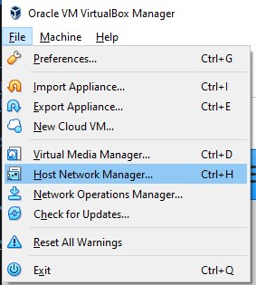
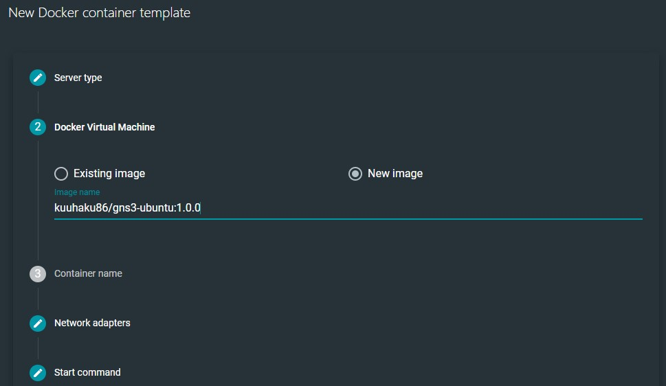
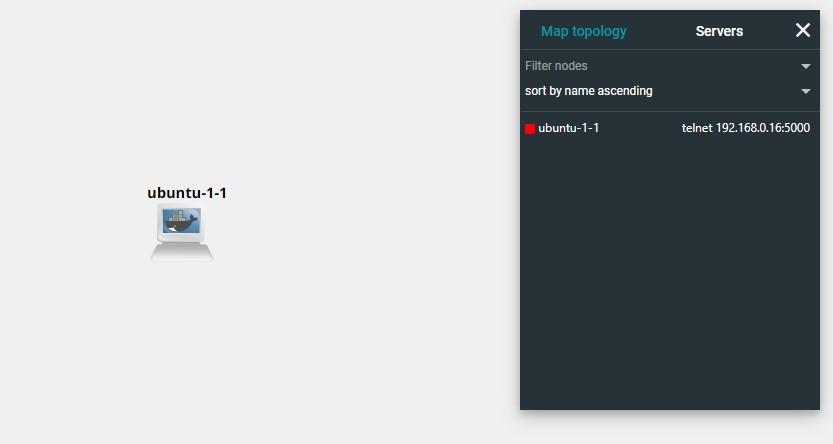
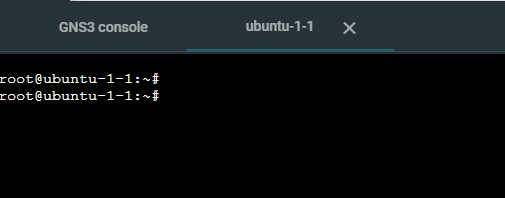
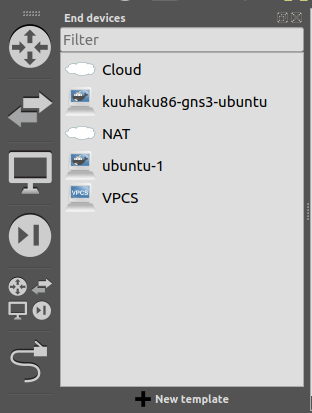
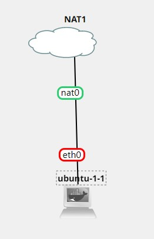
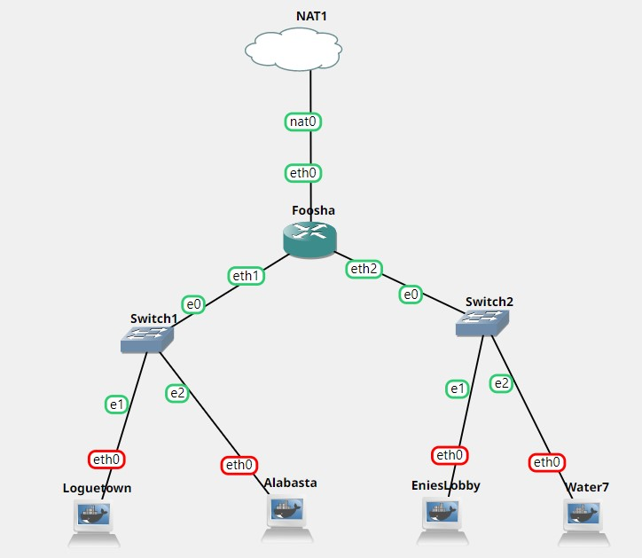
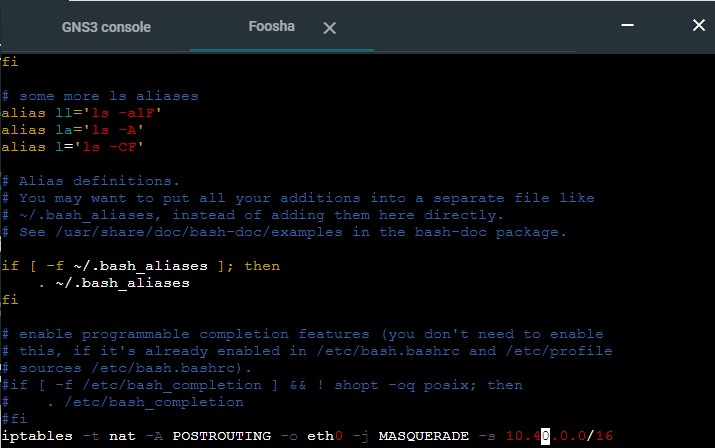
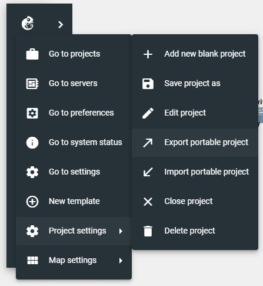

Modul Pengenalan GNS3
===============

- [Modul Pengenalan GNS3](#modul-pengenalan-gns3)
  - [Apakah GNS3 itu?](#apakah-gns3-itu)
  - [Instalasi GNS3](#instalasi-gns3)
    - [Menggunakan VM](#menggunakan-vm)
    - [Menggunakan Ubuntu](#menggunakan-ubuntu)
  - [Penggunaan GNS3](#penggunaan-gns3)
    - [Setup IP](#setup-ip)
      - [Pembagian Prefix IP](#pembagian-prefix-ip)
      - [Setup IP di Node](#setup-ip-di-node)
    - [Akses Sebuah Node ke Internet](#akses-sebuah-node-ke-internet)
    - [Membuat Topologi](#membuat-topologi)
  - [Ketentuan](#ketentuan)
  - [Peringatan, Saran, Tips, dan Trik](#peringatan-saran-tips-dan-trik)
  - [Troubleshooting](#troubleshooting)
  - [Sumber](#sumber)

## Apakah GNS3 itu?
**GNS3 (Graphical Network Simulator-3)** adalah alat yang membantu Anda untuk bisa menjalankan sebuah simulasi dari topologi kecil yang hanya terdiri dari beberapa alat saja di komputer Anda sampai dengan topologi yang memiliki banyak alat yang di-hosting di beberapa server.

## Instalasi GNS3
### Menggunakan VM
1. Install VirtualBox
Silahkan mendownload dari [link berikut.](https://www.oracle.com/virtualization/technologies/vm/downloads/virtualbox-downloads.html)

2. Download Image VM GNS3
Silahkan mendowload dari [link berikut](https://github.com/GNS3/gns3-gui/releases/download/v2.2.19/GNS3.VM.VirtualBox.2.2.19.zip). Sehabis itu langsung saja extract.

3. Import file .ova ke VirtualBox


4.  Membuat host network adapter baru
  - Pilih File Menu -> Host Network Manager <br/>

  - Klik Create <br/>

  - Lalu setting agar IPv4 Address adalah `192.168.0.1`, dan IPv4 Network Mask `255.255.255.0` lalu klik apply


5. Ubah Network Adapter di VM 
  - Pergi ke Settings -> Network
  - Ubah Adapter 1 ke Host-only Adapter dan sesuaikan dengan host network yang telah dibuat sebelumnya

  - Dan ubah Adapter 2 menjadi NAT <br/>

  - Lalu klik OK

6.  Jalankan VM
  - Maka VM seharusnya bisa menampilkan ini

  - Lalu buka alamat dengan keterangan "To launch the Web-UI" di browser


7. Import image ubuntu
  - Klik `Go to preferences`
  - Klik `Docker`
  - Klik `Add Docker container template`
  - `Server type` pilih `Run this Docker container locally`
  - Klik `Docker Virtual Machine`, pilih `New image` isikan `kuuhaku86/gns3-ubuntu:1.0.0` di Image name

  - Klik `Container name` masukkan `ubuntu-1` sebagai nama container
  - Klik `Network adapters` dan masukkan angka 4 
  - Lalu klik tombol `Add template` di bawah sendiri

8. Coba image yang telah di-import
  - Klik `Servers` di kiri atas
  - Klik `local`
  - Klik `Add blank project`
  - Masukkan nama project (terserah)
  - Klik `Add project`
  - Klik tombol `Add a node` di samping kiri <br/>

  - Lalu tarik `ubuntu-1` ke area kosong di halaman
  - Tunggu sampai loading selesai
  - Jika berhasil akan menampilkan tampilan yang mirip dengan ini

  - Kita bisa start dengan klik kanan di node dan klik `Start` <br/>


9. Akses node
  - Bisa dilakukan dengan `Web console`  <br/>

  - Bisa dilakukan menggunakan command `telnet [IP VM] [Port node]` sesuai dengan di kanan, jika menggunakan contoh di gambar, maka commandnya adalah `telnet 192.168.0.16 5000`

  - Jika menggunakan telnet, hati-hati jika ingin keluar dari node. Gunakan `Ctrl + ]` lalu ketik quit untuk keluar dari node.
  - Jika command prompt tidak kunjung keluar, bisa klik enter berkali-kali sampai keluar

### Menggunakan Ubuntu
1. Install GNS3
Silahkan ikuti step-stepnya dari link berikut [Ubuntu-based distributions (64-bit only).](https://docs.gns3.com/docs/getting-started/installation/linux/)

2. Import image ubuntu
  - Klik `Edit > preferences`
  - Klik `Docker container` (biasanya paling bawah)
  - Klik `New`
  - Pada `Docker Virtual Machine`, pilih `New image` isikan `kuuhaku86/gns3-ubuntu:1.0.0` di Image name, lalu klik next.

  - Pada `Container name` masukkan `ubuntu-1` sebagai nama container, lalu klik next.
  - Pada `Network adapters` dan masukkan angka `4`, lalu klik next.
  - Pada `Start command` biarkan kosong, lalu klik next.
  - Pada `Console type` pilih `telnet`, lalu klik next.
  - Pada `Environment` biarkan kosong, lalu klik `finish`.
  - Kemudian klik tombol `Apply` dan `OK`.

3. Coba image yang telah di-import
  - Klik `End devices` di samping kiri (icon bentuk monitor)
  <br/>

  - Lalu tarik `ubuntu-1` ke area kosong di halaman
  - Tunggu sampai loading selesai
  - Jika berhasil akan menampilkan tampilan yang mirip dengan ini

  - Kita bisa start dengan klik kanan di node dan klik `Start`.

4. Akses node
  - Bisa dilakukan dengan klik kanan di node dan klik `console`.  <br/>

  - Bisa dilakukan menggunakan command `telnet [IP VM] [Port node]` sesuai dengan di kanan, jika menggunakan contoh di gambar, maka commandnya adalah `telnet 127.0.0.1 5000` (arahkan cursor ke nodenya untuk melihat port node)

  - Jika menggunakan telnet, hati-hati jika ingin keluar dari node. Gunakan `Ctrl + ]` lalu ketik quit untuk keluar dari node.
  - Jika command prompt tidak kunjung keluar, bisa klik enter berkali-kali sampai keluar

## Penggunaan GNS3

### Setup IP
Dalam praktikum jaringan komputer, Anda akan sering melakukan setting untuk IP dari node yang digunakan. Lalu untuk membedakan ip jaringan dari masing-masing kelompok, maka 2 oktet awal (Prefix IP) dari IP yang digunakan sudah ditentukan seperti di bawah.

#### Pembagian Prefix IP

**Kelas A** 
KELOMPOK | Prefix IP
---------|------------
A1 | 192.168
A2 | 10.0
A3 | 192.169
A4 | 10.1
A5 | 192.170
A6 | 10.2
A7 | 192.171
A8 | 10.3
A9 | 192.172
A10 | 10.4
A11 | 192.173
A12 | 10.5
A13 | 192.174
A14 | 10.6
A15 | 192.175
A16 | 10.7

**Kelas B** 
KELOMPOK | Prefix IP
---------|------------
B1 | 192.176
B2 | 10.8
B3 | 192.177
B4 | 10.9
B5 | 192.178
B6 | 10.10
B7 | 192.179
B8 | 10.11
B9 | 192.180
B10 | 10.12
B11 | 192.181
B12 | 10.13
B13 | 192.182
B14 | 10.14

**Kelas C** 
KELOMPOK | Prefix IP
---------|------------
C1 | 192.183
C2 | 10.15
C3 | 192.184
C4 | 10.16
C5 | 192.185
C6 | 10.17
C7 | 192.186
C8 | 10.18
C9 | 192.187
C10 | 10.19
C11 | 192.188
C12 | 10.20
C13 | 192.189
C14 | 10.21
C15 | 192.190

**Kelas D** 
KELOMPOK | Prefix IP
---------|------------
D1 | 192.191
D2 | 10.22
D3 | 192.192
D4 | 10.23
D5 | 192.193
D6 | 10.24
D7 | 192.194
D8 | 10.25
D9 | 192.195
D10 | 10.26
D11 | 192.196
D12 | 10.27
D13 | 192.197
D14 | 10.28
D15 | 192.198
D16 | 10.29

**Kelas E** 
KELOMPOK | Prefix IP
---------|------------
E1 | 192.199
E2 | 10.30
E3 | 192.200
E4 | 10.31
E5 | 192.201
E6 | 10.32
E7 | 192.202
E8 | 10.33
E9 | 192.203
E10 | 10.34
E11 | 192.204
E12 | 10.35
E13 | 192.205
E14 | 10.36
E15 | 192.206
E16 | 10.37
E17 | 192.207

**Kelas IUP** 
KELOMPOK | Prefix IP
---------|------------
IUP1 | 10.38
IUP2 | 192.208
IUP3 | 10.39
IUP4 | 192.209
IUP5 | 10.40
IUP6 | 192.210
IUP7 | 10.41
IUP8 | 192.211

**Kelas TI** 
KELOMPOK | Prefix IP
---------|------------
TI1 | 10.42
TI2 | 192.212
TI3 | 10.43
TI4 | 192.213
TI5 | 10.44
TI6 | 192.214
TI7 | 10.45
TI8 | 192.215
TI9 | 10.46
TI10 | 192.216
TI11 | 10.47
TI12 | 192.217
TI13 | 10.48
TI14 | 192.218
TI15 | 10.49

Jika ada perintah menggunakan IP `[Prefix IP].1.2` maka contoh jika saya adalah kelompok A2 IP adalah `10.0.1.2` 

#### Setup IP di Node

1. Klik kanan pada node, buka `Configure`
2. Pada menu `General settings`, cari tombol `Edit network configuration`
3. Di situ kalian bisa setup IP sesuai dengan interface yang digunakan. Interface adalah sesuatu yang digunakan untuk menghubungkan dua device

### Akses Sebuah Node ke Internet
1. Buka menu Add a Node
2. Tarik NAT ke area kosong <br/>

3. Gunakan aktifkan menu `Add a Link` <br/>

4. Lalu klik node, pilih interface `eth0`, dan klik node NAT yang ditarik tadi <br/>

5. Lalu konfigurasi IP dari node ubuntu
  - Cari 2 line yang seperti ini 
  ```
  # auto eth0
  # iface eth0 inet dhcp
  ```
  - Uncomment kedua line tersebut, lalu save
  ```
  auto eth0
  iface eth0 inet dhcp
  ```
6. Start node
7. Akses console dari node, dan coba ping ke google, jika berhasil maka settingan Anda benar

8. Node ini akan nanti digunakan sebagai router untuk modul ini, ganti nama node ini menjadi `Foosha` dengan fitur `Change hostname` di node, dan juga ganti symbol ke simbol router dengan fitur `Change symbol`

### Membuat Topologi
1. Tambahkan beberapa node ethernet switch dan ubuntu, lalu buat hubungan antar node dan nama-nama dari node hingga seperti di gambar

2. Gunakan fitur `Change hostname` untuk merubah nama-nama dari node
3. Lalu kita setting network masing-masing node dengan fitur `Edit network configuration` seperti yang ditunjukkan [disini](#setup-ip-di-node) sebelumnya, kita bisa menghapus semua settingnya dan mengisi dengan settingan di bawah
  - Foosha
  ```
  auto eth0
  iface eth0 inet dhcp

  auto eth1
  iface eth1 inet static
  	address [Prefix IP].1.1
  	netmask 255.255.255.0

  auto eth2
  iface eth2 inet static
  	address [Prefix IP].2.1
  	netmask 255.255.255.0
  ```
  - Loguetown
  ```
  auto eth0
  iface eth0 inet static
  	address [Prefix IP].1.2
  	netmask 255.255.255.0
    gateway [Prefix IP].1.1
  ```
  - Alabasta
  ```
  auto eth0
  iface eth0 inet static
  	address [Prefix IP].1.3
  	netmask 255.255.255.0
    gateway [Prefix IP].1.1
  ```
  - EniesLobby
  ```
  auto eth0
  iface eth0 inet static
  	address [Prefix IP].2.2
  	netmask 255.255.255.0
    gateway [Prefix IP].2.1
  ```
  - Water7
  ```
  auto eth0
  iface eth0 inet static
  	address [Prefix IP].2.3
  	netmask 255.255.255.0
    gateway [Prefix IP].2.1
  ```
**Penjelasan Pengertian**
- **Gateway**: Jalur pada jaringan yang harus dilewati paket-paket data untuk dapat masuk ke jaringan yang lain.

4. Restart semua node
5. Cek semua node ubuntu apakah sudah memiliki ip yang sesuai dengan settingan dengan command `ip a`. Berikut adalah contoh untuk node `Foosha` dengan Prefix IP `10.40`, sesuaikan dengan Prefix IP kelompok kalian masing-masing

6. Topologi yang dibuat sudah bisa berjalan secara lokal, tetapi kita belum bisa mengakses jaringan keluar. Maka kita perlu melakukan beberapa hal.
- Ketikkan **`iptables -t nat -A POSTROUTING -o eth0 -j MASQUERADE -s [Prefix IP].0.0/16`** pada router `Foosha`
**Keterangan:**
  - **iptables:** iptables merupakan suatu tools dalam sistem operasi Linux yang berfungsi sebagai filter terhadap lalu lintas data. Dengan iptables inilah kita akan mengatur semua lalu lintas dalam komputer, baik yang masuk, keluar, maupun yang sekadar melewati komputer kita. Untuk penjelasan lebih lanjut nanti akan dibahas pada Modul 5.
  - **NAT (Network Address Translation):** Suatu metode penafsiran alamat jaringan yang digunakan untuk menghubungkan lebih dari satu komputer ke jaringan internet dengan menggunakan satu alamat IP.
  - **Masquerade:** Digunakan untuk menyamarkan paket, misal mengganti alamat pengirim dengan alamat router.
  - **-s (Source Address):** Spesifikasi pada source. Address bisa berupa nama jaringan, nama host, atau alamat IP.
- Ketikkan command `cat /etc/resolv.conf` di `Foosha`

- Ingat-ingat IP tersebut karena IP tersebut merupakan IP DNS, lalu ketikkan command ini di node ubuntu yang lain `echo nameserver [IP DNS] > /etc/resolv.conf`. Jika pada kasus contoh maka command-nya adalah `echo nameserver 192.168.122.1 > /etc/resolv.conf`. 
- Semua node sekarang seharusnya sudah bisa melakukan ping ke google, yang artinya adalah sudah tersambung ke internet

## Ketentuan
- Praktikan **hanya** diperbolehkan menggunakan image docker `kuuhaku86/gns3-ubuntu`

## Peringatan, Saran, Tips, dan Trik
- Apa yang diinstal di node **tidak persisten**, artinya saat Anda mengerjakan project tersebut lagi Anda perlu menginstal aplikasi itu kembali
- Maka **selalu** simpan config di node ke directory `/root` sebelum keluar dari project
- Anda bisa memasukkan command yang ingin selalu dijalankan di node tersebut ke file `/root/.bashrc` di bagian paling bawah. (Contoh : command iptables dan echo nameserver tadi)

- Anda bisa melakukan ekspor project jika bekerja secara tim dengan pergi ke menu `Project settings` -> `Export portable project`.


## Troubleshooting
- 


## Sumber
- https://docs.gns3.com/docs/